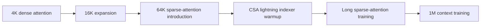

# DeepSeek V4 Technical Report Deep Dive

## 0. Executive Summary

The core of DeepSeek V4 is not simply "a bigger model." It is an engineering attempt to move one-million-token context from "theoretically possible" toward "deployable at system scale." The report moves four major levers at once:

- Hybrid CSA/HCA/SWA attention reduces FLOPs and KV-cache pressure at 1M context.
- mHC and Muon support deeper, larger, sparser MoE training.
- Specialist training, GRPO, GRM, OPD, and QAT consolidate reasoning, coding, agentic, tool-use, and instruction-following capabilities into unified models.
- MegaMoE, TileLang, heterogeneous KV-cache management, on-disk prefix cache, million-token RL infrastructure, and the DSec sandbox turn the architecture into an executable training and serving system.

Key numbers from the report:

| Item                           | DeepSeek-V4-Flash | DeepSeek-V4-Pro |
| ------------------------------ | ----------------: | --------------: |
| Total parameters               |              284B |            1.6T |
| Activated parameters per token |               13B |             49B |
| Pre-training tokens            |               32T |             33T |
| Context length                 |                1M |              1M |
| CSA compression rate `m`       |                 4 |               4 |
| CSA top-k                      |               512 |            1024 |
| HCA compression rate `m'`      |               128 |             128 |
| SWA window                     |               128 |             128 |

## 1. Architecture Overview

DeepSeek V4 remains a Transformer + MoE family, but the critical path changes substantially:

1. It inherits DeepSeekMoE: every layer uses MoE with shared and routed experts.
2. It inherits MTP: multi-token prediction depth is 1.
3. It adds mHC: Manifold-Constrained Hyper-Connections stabilize deep residual signal propagation.
4. It adds hybrid attention: CSA + HCA + SWA jointly handle long context.
5. It uses Muon: most modules are updated with Muon, while selected modules stay on AdamW.
6. It adds stability methods: Anticipatory Routing and SwiGLU Clamping.

### 1.1 V4-Flash

V4-Flash is the smaller-activated-footprint, efficiency-oriented variant.

| Dimension                   | Setting                       |
| --------------------------- | ----------------------------- |
| Transformer layers          | 43                            |
| Hidden dimension            | 4096                          |
| Total parameters            | 284B                          |
| Activated parameters        | 13B                           |
| First two attention layers  | Pure sliding window attention |
| Later attention layers      | CSA/HCA interleaved           |
| CSA `m`                     | 4                             |
| CSA indexer heads           | 64                            |
| CSA indexer head dimension  | 128                           |
| CSA top-k                   | 512                           |
| HCA `m'`                    | 128                           |
| Query heads                 | 64                            |
| Head dimension              | 512                           |
| Query compression dimension | 1024                          |
| Output projection groups    | 8                             |
| MoE experts                 | 1 shared + 256 routed         |
| Activated routed experts    | 6                             |
| Expert hidden dimension     | 2048                          |
| mHC expansion factor        | 4                             |
| Sinkhorn iterations         | 20                            |

### 1.2 V4-Pro

V4-Pro is the higher-capacity variant aimed at stronger knowledge retention, hard reasoning, long-context use, and agentic tasks.

| Dimension                   | Setting               |
| --------------------------- | --------------------- |
| Transformer layers          | 61                    |
| Hidden dimension            | 7168                  |
| Total parameters            | 1.6T                  |
| Activated parameters        | 49B                   |
| First two attention layers  | HCA                   |
| Later attention layers      | CSA/HCA interleaved   |
| CSA `m`                     | 4                     |
| CSA indexer heads           | 64                    |
| CSA indexer head dimension  | 128                   |
| CSA top-k                   | 1024                  |
| HCA `m'`                    | 128                   |
| Query heads                 | 128                   |
| Head dimension              | 512                   |
| Query compression dimension | 1536                  |
| Output projection groups    | 16                    |
| MoE experts                 | 1 shared + 384 routed |
| Activated routed experts    | 6                     |
| Expert hidden dimension     | 3072                  |
| mHC expansion factor        | 4                     |
| Sinkhorn iterations         | 20                    |

## 2. Core Algorithms and Formulas

### 2.1 mHC: Manifold-Constrained Residual Connections

A standard residual stream is a single hidden-state stream. Hyper-Connections expand it into `n_hc` parallel residual states, then combine them through input, residual, and output mappings.

Basic update:

```text
X_{l+1} = B_l X_l + C_l F_l(A_l X_l)
```

Where:

- `X_l` is the residual state before layer `l`.
- `F_l` is the `l`-th Transformer/MoE layer.
- `A_l` maps the expanded residual stream into the actual layer input.
- `B_l` transforms residual states across the expanded stream.
- `C_l` writes the layer output back into the expanded residual stream.

The key mHC idea is to constrain `B_l` to the manifold of doubly stochastic matrices:

```text
B_l in M = { M in R^(n x n) | M 1_n = 1_n, 1_n^T M = 1_n^T, M >= 0 }
```

This gives two stabilizing properties:

- `||B_l||_2 <= 1`, so the residual transformation is non-expansive.
- Doubly stochastic matrices are closed under multiplication, which helps stability across deep stacks.

Practical parameterization:

```text
M^(0) = exp(B_tilde_l)
M^(t) = T_row(T_col(M^(t-1)))
B_l = M^(t_max),  t_max = 20
```

This is a Sinkhorn-Knopp projection: exponentiate to ensure positivity, then alternate column and row normalization until the matrix satisfies the constraint.

### 2.2 CSA: Compressed Sparse Attention

CSA first compresses historical KV cache, then selects top-k compressed history blocks. It avoids making every query attend to all historical tokens.

Compressed KV:

```text
C_a = H W_aKV
C_b = H W_bKV
Z_a = H W_aZ
Z_b = H W_bZ
C_i^comp = sum_j S_a,j * C_a,j + sum_j S_b,j * C_b,j
```

Interpretation:

- `H` is the input hidden-state sequence.
- `C_a` and `C_b` are two KV-entry streams.
- `Z_a` and `Z_b` are compression weights.
- Every `m` tokens become one compressed entry.
- CSA uses overlapping compression, so each compressed entry is effectively derived from neighboring `2m` candidate tokens.

Lightning indexer:

```text
c_t^Q = h_t W_DQ
q_t^I = c_t^Q W_IUQ
I_{t,s} = sum_h w_{t,h}^I ReLU(q_{t,h}^I K_s^IComp)
C_t^sparse = { C_s^comp | I_{t,s} in Top-k(I_{t,:}) }
```

Interpretation:

- Query token `t` produces an indexer query.
- Every historical compressed block `s` receives an index score.
- Only top-k compressed KV entries enter core attention.
- V4-Flash uses top-k=512; V4-Pro uses top-k=1024.

CSA decomposes long context into two savings:

1. Compression shortens the sequence to roughly `1/m`.
2. Sparse top-k selection further reduces the number of historical blocks each query reads.

### 2.3 HCA: Heavily Compressed Attention

HCA has a different objective. It does not use sparse selection. Instead, it compresses KV much more aggressively and then performs dense attention over that heavily compressed memory.

```text
C = H W_KV
Z = H W_Z
S = softmax_row(Z + B)
C_i^comp = sum_j S_j * C_j
```

Differences from CSA:

- CSA uses `m=4`.
- HCA uses `m'=128`.
- CSA is "compression + sparse retrieval."
- HCA is "heavy compression + dense global memory."

This explains the interleaved design: CSA behaves like retrievable medium/long-range memory, while HCA behaves like extremely compressed global memory for very long contexts.

### 2.4 SWA: Sliding Window Attention

CSA and HCA only read completed compressed historical blocks. For strict causality, a query cannot access future tokens inside its own compression block, and compression can damage local detail.

V4 therefore adds a sliding-window branch:

- Every query can additionally read the most recent `n_win=128` uncompressed KV entries.
- This branch preserves local language modeling, short-range dependencies, and fine-grained information.

### 2.5 Attention Sink

The report uses attention sink:

```text
s_{h,i,j} = exp(z_{h,i,j}) / (sum_k exp(z_{h,i,k}) + exp(z'_h))
```

In ordinary attention, each head must distribute all attention mass across tokens or blocks. With a sink logit, some mass can be absorbed by the sink, allowing a head not to force probability onto irrelevant tokens.

This is useful for compressed attention: if selected compressed blocks are weakly relevant, or if a head does not need long-range information for the current token, it does not have to assign probability to irrelevant memory.

### 2.6 Muon Optimizer

V4 uses Muon for most parameters and AdamW for selected modules:

- embedding module
- prediction head
- RMSNorm weights
- mHC static biases and gating factors

Muon update:

```text
G_t = grad_W L_t(W_{t-1})
M_t = mu M_{t-1} + G_t
O'_t = HybridNewtonSchulz(mu M_t + G_t)
O_t = O'_t * sqrt(max(n,m)) * gamma
W_t = W_{t-1} * (1 - eta lambda) - eta O_t
```

Important settings:

- Momentum `mu=0.95`
- Weight decay `0.1`
- Update RMS rescale factor `0.18`
- Nesterov trick
- Hybrid Newton-Schulz orthogonalization

Hybrid Newton-Schulz:

```text
M_k = a M_{k-1}
    + b (M_{k-1} M_{k-1}^T) M_{k-1}
    + c (M_{k-1} M_{k-1}^T)^2 M_{k-1}
```

The first 8 iterations use `(a,b,c)=(3.4445,-4.7750,2.0315)` to rapidly push singular values close to 1. The final 2 iterations use `(2,-1.5,0.5)` for stabilization.

### 2.7 OPD: On-Policy Distillation

The post-training stage uses multi-teacher OPD to merge specialist capabilities:

```text
L_OPD(theta) = sum_i w_i * KL(pi_theta || pi_Ei)
```

Where:

- `pi_theta` is the student model.
- `pi_Ei` is expert teacher `i`.
- Training trajectories are sampled from the student itself, hence on-policy.
- Reverse KL aligns the student with relevant specialists for each task context.
- The report uses full-vocabulary logit distillation instead of token-level KL approximation to reduce gradient variance.

## 3. Data Construction

The report discloses data directions, but not exact mixture proportions. It is therefore unsafe to infer a precise training recipe from the text.

Disclosed data-construction points:

- The corpus builds on DeepSeek-V3 pre-training data.
- It improves diversity, quality, and effective long context.
- Web data filtering removes batched auto-generated and templated content to reduce model-collapse risk.
- Math and programming corpora remain core components.
- Agentic data is incorporated during mid-training to improve coding and agentic capabilities.
- A larger multilingual corpus is built for long-tail cultural knowledge.
- Long-document curation prioritizes scientific papers, technical reports, and other academically valuable materials.
- The total pre-training corpus exceeds 32T tokens.
- The tokenizer keeps a 128K vocabulary.
- Token-splitting and Fill-in-Middle are inherited.
- A few special tokens are added for context construction.
- Cross-source document packing reduces sample truncation.
- Sample-level attention masking is used.

Major missing details:

- Exact token shares for web, math, code, multilingual, long-document, and agentic data.
- Deduplication thresholds.
- Contamination-detection details.
- Synthetic-data proportions.
- Precise data curriculum across stages.

The safest reading: the data strategy is clearly important, but the report does not reveal the full mixture recipe.

## 4. Pre-training Process

### 4.1 V4-Flash Training Setup

| Item                                  |                     Setting |
| ------------------------------------- | --------------------------: |
| Tokens                                |                         32T |
| Max batch size                        |                75.5M tokens |
| AdamW beta1                           |                         0.9 |
| AdamW beta2                           |                        0.95 |
| AdamW epsilon                         |                       1e-20 |
| Weight decay                          |                         0.1 |
| Muon momentum                         |                        0.95 |
| Muon update RMS rescale               |                        0.18 |
| Peak LR                               |                      2.7e-4 |
| Final LR                              |                      2.7e-5 |
| LR warmup                             |                  2000 steps |
| Sequence length schedule              |      4K -> 16K -> 64K -> 1M |
| Dense attention warmup                |             First 1T tokens |
| Auxiliary-loss-free bias update speed |                       0.001 |
| Balance loss weight                   |                      0.0001 |
| MTP loss weight                       | 0.3, then 0.1 near LR decay |

### 4.2 V4-Pro Training Setup

| Item                      |                              Setting |
| ------------------------- | -----------------------------------: |
| Tokens                    |                                  33T |
| Max batch size            |                         94.4M tokens |
| Peak LR                   |                               2.0e-4 |
| Final LR                  |                               2.0e-5 |
| Sequence length schedule  |               4K -> 16K -> 64K -> 1M |
| Dense attention stage     |                    Longer than Flash |
| Sparse attention strategy | Same two-stage introduction as Flash |
| Balance loss weight       |                               0.0001 |
| MTP loss weight           |          0.3, then 0.1 near LR decay |

### 4.3 Sparse Attention Introduction



The key point is curriculum. The model is not trained with full 1M sparse attention from the start. It moves from shorter sequences and dense attention toward indexer warmup, long sparse-attention training, and eventually 1M context.

## 5. Training Stability

The report encountered loss spikes during trillion-parameter MoE training. The authors associate these spikes with MoE outliers and a feedback loop induced by routing.

### 5.1 Anticipatory Routing

Core idea:

- At step `t`, feature computation uses current parameters `theta_t`.
- Routing indices are computed using historical parameters `theta_{t-Delta t}`.
- This decouples backbone updates from routing updates.

Engineering implementation:

- Data for step `t` is fetched at step `t-Delta t`.
- Routing indices are computed and cached ahead of time.
- When a loss spike occurs, training triggers a short rollback and activates Anticipatory Routing.
- After a period in this mode, training returns to standard routing.

The report says the additional wall-clock overhead is optimized to roughly 20% while active, and because it is only dynamically enabled after spikes, total extra training overhead is negligible.

### 5.2 SwiGLU Clamping

V4 clamps SwiGLU values:

- The linear component is clamped to `[-10, 10]`.
- The gate component is capped at `10`.

This directly suppresses outliers. The report acknowledges that the theory remains incomplete, but empirically the method stabilizes training without hurting performance.

## 6. Post-training Process

The key post-training change is that OPD replaces the mixed RL stage used in DeepSeek-V3.2.


### 6.1 Specialist Training

Each specialist model goes through:

1. initial fine-tuning
2. domain-specific GRPO RL

Specialist domains include:

- math
- coding
- agentic tasks
- instruction following
- tool use
- long-context tasks

### 6.2 Reasoning Effort Modes

| Mode       | Characteristics              | Typical use cases                                 | Response format                                      |
| ---------- | ---------------------------- | ------------------------------------------------- | ---------------------------------------------------- |
| Non-think  | Fast, intuitive, low-latency | Daily tasks, low-risk decisions                   | `</think> summary`                                   |
| Think High | Slower, more logical         | Complex problems, planning, medium-risk decisions | `<think>...</think> summary`                         |
| Think Max  | Maximum reasoning budget     | Exploring the model's reasoning frontier          | Special system prompt + `<think>...</think> summary` |

Think Max injects a special system instruction that pushes the model to decompose the problem thoroughly, stress-test logic, and consider edge cases and adversarial paths.

### 6.3 Generative Reward Model

Traditional RLHF often trains a scalar reward model. The V4 report instead emphasizes a Generative Reward Model for hard-to-verify tasks:

- Uses rubric-guided RL data.
- Lets the actor network also act as an evaluator.
- Uses the model's internal reasoning ability for more robust scoring.
- Reduces dependence on large-scale human reward annotation.

### 6.4 Tool-call Schema

V4 introduces a DSML/XML-style tool-call schema:

```xml
<|DSML|tool_calls>
<|DSML|invoke name="$TOOL_NAME">
<|DSML|parameter name="$PARAMETER_NAME" string="true|false">
$PARAMETER_VALUE
</|DSML|parameter>
</|DSML|invoke>
</|DSML|tool_calls>
```

Design goals:

- Reduce JSON/string escaping failures.
- Reduce tool-call errors.
- Explicitly define ordering between thinking mode and tool calls.

### 6.5 Interleaved Thinking

V4 keeps reasoning traces in tool-calling scenarios:

- Tool-calling conversations: reasoning content is preserved across all rounds, including across user-message boundaries.
- Ordinary chat: previous reasoning content is discarded after a new user message to keep context concise.

This is directly tied to 1M context. Long-horizon agents can preserve reasoning state instead of reconstructing it every turn.

### 6.6 Quick Instruction

Quick Instruction turns auxiliary tasks into special tokens instead of routing them to a separate small model.

| Token | Purpose        |       |                                         |     |                                                |
| ----- | -------------- | ----- | --------------------------------------- | --- | ---------------------------------------------- |
| `<   | action         | >`   | Decide whether web search is needed     |     |                                                |
| `<   | title          | >`   | Generate a conversation title           |     |                                                |
| `<   | query          | >`   | Generate search queries                 |     |                                                |
| `<   | authority      | >`   | Determine source-authority requirements |     |                                                |
| `<   | domain         | >`   | Identify the user's domain              |     |                                                |
| `<   | extracted_url | >`/`< | read_url                               | >` | Decide whether URLs should be fetched and read |

Benefits:

- Reuses the already computed KV cache.
- Avoids redundant prefill by a separate small model.
- Reduces user-perceived time to first token.
- Allows tasks such as query, authority, and domain detection to run in parallel.

## 7. Post-training Infrastructure

### 7.1 FP4 Quantization-Aware Training

QAT is applied to two components:

1. MoE expert weights
2. the CSA indexer's QK path

The report states:

- CSA index scores are quantized from FP32 to BF16.
- The top-k selector obtains a 2x speedup.
- KV-entry recall remains 99.7%.
- FP4 expert weights are quantized and then dequantized to FP8 for computation during training.
- During rollout/inference, native FP4 weights are used directly so sampling behavior matches deployment.

### 7.2 Full-vocabulary OPD Teacher Scheduling

Challenge:

- There are more than ten teacher models.
- Each teacher may have trillions of parameters.
- Vocabulary size exceeds 100K, so caching all teacher logits is impractical.

Solution:

- Store teacher weights in centralized distributed storage.
- Load teachers on demand for teacher forward passes.
- Cache only last-layer hidden states, not full logits.
- Reconstruct full logits during training through the corresponding prediction head.
- Dispatch samples by teacher index so only one teacher head needs to reside on device at a time.
- Compute KL divergence with a specialized TileLang kernel.

### 7.3 Fault-tolerant Rollout Service

RL/OPD rollout at large GPU-cluster scale faces preemption and hardware failure. The report uses token-granular write-ahead logs:

- Every generated token is immediately appended to the request's WAL.
- On preemption, the inference engine is paused and KV cache for unfinished requests is saved.
- On resume, decoding continues using the WAL and saved KV cache.
- On fatal hardware error, the persisted WAL tokens can reconstruct KV cache through prefill.

The report highlights a correctness issue: regenerating unfinished requests from scratch is mathematically wrong because it introduces length bias. Shorter responses are more likely to survive interruptions.

## 8. General Infrastructure

### 8.1 MegaMoE

MegaMoE decomposes expert-parallel computation into fine-grained pipeline stages:

- Dispatch
- Linear-1
- SwiGLU / FP8 cast
- Linear-2
- Combine

Wave-level scheduling overlaps communication, computation, and result return.

The report claims:

- 1.50x to 1.73x speedup in common inference scenarios.
- Up to 1.96x in latency-sensitive scenarios.

### 8.2 TileLang

TileLang is a DSL for kernel development. In the report, it helps with:

- overhead from many small ATen operators
- fused kernel development
- faster experimentation with attention variants
- special kernels such as OPD KL computation

### 8.3 Deterministic Kernels

DeepSeek emphasizes batch-invariant and deterministic kernels:

- deterministic MoE dispatch
- deterministic MoE combine
- deterministic mHC small matrix multiplication

This reduces output drift caused by batch variation, which matters for reproducibility, serving stability, and evaluation consistency.

### 8.4 KV-cache Management

V4's KV cache is heterogeneous. It contains:

- CSA/HCA compressed KV
- CSA indexer KV
- SWA uncompressed KV
- unfinished compression-tail states

Traditional PagedAttention assumes homogeneous KV shapes. V4 therefore needs a heterogeneous layout and management strategy.

### 8.5 On-disk Prefix Cache

In long-context serving, many requests share long prefixes. V4 stores compressed KV on disk for reuse.

SWA KV is roughly 8x larger than compressed KV, so the system offers three strategies:

- full caching: stores all SWA KV, fastest recovery, largest storage cost
- periodic checkpointing: stores checkpoints periodically, balancing space and recomputation
- zero caching: stores no SWA KV, minimizing storage but requiring recomputation

## 9. Evaluation Results

### 9.1 Base Models: Table 1

Table 1 evaluates base models after pre-training and before final post-training, under a unified internal framework.

| Benchmark          | V3.2 Base | V4-Flash Base | V4-Pro Base |
| ------------------ | --------: | ------------: | ----------: |
| Activated Params   |       37B |           13B |         49B |
| Total Params       |      671B |          284B |        1.6T |
| MMLU               |      87.8 |          88.7 |        90.1 |
| MMLU-Pro           |      65.5 |          68.3 |        73.5 |
| MultiLoKo          |      38.7 |          42.2 |        51.1 |
| Simple-QA verified |      28.3 |          30.1 |        55.2 |
| FACTS Parametric   |      27.1 |          33.9 |        62.6 |
| HumanEval          |      62.8 |          69.5 |        76.8 |
| GSM8K              |      91.1 |          90.8 |        92.6 |
| MATH               |      60.5 |          57.4 |        64.5 |
| LongBench-V2       |      40.2 |          44.7 |        51.5 |

Reading:

- V4-Flash activates far fewer parameters than V3.2 yet beats it on many benchmarks, suggesting gains from architecture, data, and training.
- V4-Pro improves knowledge-heavy tasks especially strongly, including Simple-QA verified and FACTS Parametric.
- Base coding performance is not uniformly monotonic: BigCodeBench is not a universal V4 win.

### 9.2 Post-trained Models: Table 7

Table 7 compares Non-think, High, and Max modes for V4-Flash and V4-Pro.

| Benchmark          | Flash Non | Flash High | Flash Max | Pro Non | Pro High | Pro Max |
| ------------------ | --------: | ---------: | --------: | ------: | -------: | ------: |
| MMLU-Pro           |      83.0 |       86.4 |      86.2 |    82.9 |     87.1 |    87.5 |
| SimpleQA-Verified  |      23.1 |       28.9 |      34.1 |    45.0 |     46.2 |    57.9 |
| Chinese-SimpleQA   |      71.5 |       73.2 |      78.9 |    75.8 |     77.7 |    84.4 |
| GPQA Diamond       |      71.2 |       87.4 |      88.1 |    72.9 |     89.1 |    90.1 |
| HLE                |       8.1 |       29.4 |      34.8 |     7.7 |     34.5 |    37.7 |
| LiveCodeBench      |      55.2 |       88.4 |      91.6 |    56.8 |     89.8 |    93.5 |
| Codeforces Rating  |         - |       2816 |      3052 |       - |     2919 |    3206 |
| HMMT 2026 Feb      |      40.8 |       91.9 |      94.8 |    31.7 |     94.0 |    95.2 |
| IMOAnswerBench     |      41.9 |       85.1 |      88.4 |    35.3 |     88.0 |    89.8 |
| Apex               |       1.0 |       19.1 |      33.0 |     0.4 |     27.4 |    38.3 |
| Apex Shortlist     |       9.3 |       72.1 |      85.7 |     9.2 |     85.5 |    90.2 |
| MRCR 1M            |      37.5 |       76.9 |      78.7 |    44.7 |     83.3 |    83.5 |
| CorpusQA 1M        |      15.5 |       59.3 |      60.5 |    35.6 |     56.5 |    62.0 |
| Terminal Bench 2.0 |      49.1 |       56.6 |      56.9 |    59.1 |     63.3 |    67.9 |
| SWE Verified       |      73.7 |       78.6 |      79.0 |    73.6 |     79.4 |    80.6 |
| SWE Pro            |      49.1 |       52.3 |      52.6 |    52.1 |     54.4 |    55.4 |
| SWE Multilingual   |      69.7 |       70.2 |      73.3 |    69.8 |     74.1 |    76.2 |
| BrowseComp         |         - |       53.5 |      73.2 |       - |     80.4 |    83.4 |
| HLE w/ tools       |         - |       40.3 |      45.1 |       - |     44.7 |    48.2 |
| MCPAtlas Public    |      64.0 |       67.4 |      69.0 |    69.4 |     74.2 |    73.6 |
| GDPval-AA          |         - |          - |      1395 |       - |        - |    1554 |
| Toolathlon         |      40.7 |       43.5 |      47.8 |    46.3 |     49.0 |    51.8 |

Main takeaways:

- Hard reasoning tasks are highly sensitive to reasoning effort, especially GPQA, HLE, LiveCodeBench, HMMT, and Apex.
- Long-context tasks also benefit strongly from High/Max modes, but 1M context does not mean perfect memory.
- Agentic tasks generally favor Pro over Flash, though leading closed models still win some categories.

### 9.3 External Model Comparison: Table 6

Representative numbers:

| Benchmark          | Opus-4.6 Max | GPT-5.4 xHigh | Gemini-3.1 High | K2.6 Thinking | GLM-5.1 Thinking | DS-V4-Pro Max |
| ------------------ | -----------: | ------------: | --------------: | ------------: | ---------------: | ------------: |
| MMLU-Pro           |         89.1 |          87.5 |            91.0 |          87.1 |             86.0 |          87.5 |
| SimpleQA-Verified  |         46.2 |          45.3 |            75.6 |          36.9 |             38.1 |          57.9 |
| GPQA Diamond       |         91.3 |          93.0 |            94.3 |          90.5 |             86.2 |          90.1 |
| HLE                |         40.0 |          39.8 |            44.4 |          36.4 |             34.7 |          37.7 |
| LiveCodeBench      |         88.8 |             - |            91.7 |          89.6 |                - |          93.5 |
| Codeforces Rating  |            - |          3168 |            3052 |             - |                - |          3206 |
| MRCR 1M            |         92.9 |             - |            76.3 |             - |                - |          83.5 |
| Terminal Bench 2.0 |         65.4 |          75.1 |            68.5 |          66.7 |             63.5 |          67.9 |
| BrowseComp         |         83.7 |          82.7 |            85.9 |          83.2 |             79.3 |          83.4 |
| Toolathlon         |         47.2 |          54.6 |            48.8 |          50.0 |             40.7 |          51.8 |

Reading:

- DS-V4-Pro-Max is strong among open models, especially on code and some math/tool tasks.
- It is not universally ahead of top closed models.
- Gemini is very strong on SimpleQA, Chinese-SimpleQA, GPQA, HLE, and related knowledge/reasoning tasks.
- GPT-5.4 xHigh is strong on Terminal Bench, GDPval-AA, and Toolathlon.
- Opus remains strong on MRCR 1M, CorpusQA 1M, and SWE-style tasks.

### 9.4 Search Evaluation

Agentic Search vs RAG:

| Difficulty | Category        |   N | Agent win | RAG win | Tie | Agent% | RAG% | Tie% |
| ---------- | --------------- | --: | --------: | ------: | --: | -----: | ---: | ---: |
| Easy       | Objective Q\&A  | 196 |       110 |      43 |  43 |   56.1 | 21.9 | 21.9 |
| Easy       | Subjective Q\&A | 321 |       198 |      56 |  67 |   61.7 | 17.4 | 20.9 |
| Hard       | Objective Q\&A  | 168 |       102 |      33 |  33 |   60.7 | 19.6 | 19.6 |
| Hard       | Subjective Q\&A | 184 |       126 |      27 |  31 |   68.5 | 14.7 | 16.8 |
| Total      | Total           | 869 |       536 |     159 | 174 |   61.7 | 18.3 | 20.0 |

Cost:

| Version           | Tool calls | Prefill tokens | Output tokens |
| ----------------- | ---------: | -------------: | ------------: |
| V4 Agentic Search |       16.2 |         13,649 |         1,526 |
| V4 RAG            |          - |         10,453 |         1,308 |

Reading:

- Agentic Search is stronger but more expensive.
- Most tool calls are parallel, so tool-call count is not the same as latency.
- Subjective and hard subjective Q\&A show the largest advantage for Agentic Search.

### 9.5 Chinese Writing and White-collar Tasks

Functional writing, Table 12:

| Overall                    | DS win | Gemini win |   Tie |
| -------------------------- | -----: | ---------: | ----: |
| Chinese Functional Writing | 62.65% |     34.10% | 3.25% |

Creative writing, Table 13:

| Axis                  | DS win | Gemini win |   Tie |
| --------------------- | -----: | ---------: | ----: |
| Instruction Following | 60.03% |     39.44% | 0.53% |
| Writing Quality       | 77.48% |     22.35% | 0.18% |

Complex instruction and multi-turn writing, Table 14:

| Category                      |   DS% | Opus% | Tie% |
| ----------------------------- | ----: | ----: | ---: |
| Complex Instruction Following | 46.9% | 53.1% | 0.0% |
| Multi-Turn Writing            | 45.6% | 51.7% | 2.7% |

White-collar tasks:

- 30 advanced Chinese professional tasks.
- 13 industries, including finance, education, law, and technology.
- Internal agent harness with Bash and web search.
- Blind human evaluation against Opus-4.6-Max.

Dimension scores:

| Dimension             | DeepSeek-V4-Pro-Max | Opus-4.6-Max |
| --------------------- | ------------------: | -----------: |
| Task Completion       |               98.32 |        96.68 |
| Instruction Following |               87.76 |        88.88 |
| Content Quality       |               83.32 |        78.00 |
| Formatting Aesthetics |               72.68 |        76.68 |
| Overall               |               86.52 |        84.06 |

Reading:

- DeepSeek is stronger on task completion and content quality.
- Opus is slightly stronger on instruction following and formatting aesthetics.
- The report acknowledges room for improvement in concise summarization of long inputs and slide visual design.

### 9.6 Code Agent

Internal R\&D Coding Benchmark:

| Model               | Pass Rate |
| ------------------- | --------: |
| Haiku 4.5           |       13% |
| Sonnet 4.5          |       47% |
| DeepSeek-V4-Pro-Max |       67% |
| Opus 4.5            |       70% |
| Opus 4.5 Thinking   |       73% |
| Opus 4.6 Thinking   |       80% |

Dataset notes:

- Around 200 internal R\&D tasks were collected.
- They came from 50+ internal engineers.
- Tasks cover feature development, bug fixing, refactoring, and diagnostics.
- Technology stacks include PyTorch, CUDA, Rust, and C\++.
- After quality filtering, 30 tasks were retained.

Internal user survey:

- N=85, all DeepSeek developers or researchers who used DeepSeek-V4-Pro for daily agentic coding.
- 52% said it was ready to be their default primary coding model.
- 39% leaned yes.
- Fewer than 9% said no.

## 10. How I Would Use This Report

### 10.1 Worth Tracking Closely

1. The low-cost long-context route: CSA/HCA/SWA is the most important architecture story in the report.
2. The 1M-context serving stack: heterogeneous KV cache, on-disk prefix cache, and million-token RL infrastructure are worth close attention.
3. Post-training consolidation: OPD replacing mixed RL suggests a shift from weight merging/mixed training toward finer logits-level distillation.
4. Agent infrastructure: DSec, tool schema, interleaved thinking, and Quick Instruction are clearly designed for real agent products.

### 10.2 Do Not Overgeneralize

1. 1M context is not perfect memory. MRCR and CorpusQA still show clear difficulty.
2. Lower FLOPs/KV cache does not directly mean cheaper API usage. Price depends on hardware, batching, cache hit rate, concurrency, and vendor pricing.
3. Training format is not an API contract. `<think>`, DSML, and tool schemas should not be treated as final public-interface guarantees.
4. Data mixture is not public. The report does not reveal a reproducible training recipe.
5. Many evaluations are internal. Table 1, search, white-collar tasks, and R\&D coding all rely partly on internal frameworks or harnesses.
6. Some stability methods remain empirical. Anticipatory Routing and SwiGLU Clamping work in the report, but their theory is still open.

## 11. Final Judgment

The value of DeepSeek V4 is not only its leaderboard numbers. It proposes a clear long-context engineering route:

```text
compressed attention -> sparse retrieval -> heavily compressed global memory
    -> local-window detail preservation -> MoE capacity expansion
    -> Muon-stabilized training -> OPD specialist consolidation
    -> FP4/QAT/cache/sandbox/rollout infrastructure for deployment
```

If later APIs can reliably provide 1M context, controllable reasoning effort, reasonable pricing, and robust tool calling, this architecture could directly affect codebase-scale agents, long-document research, enterprise knowledge systems, browsing-style search, and complex office automation.

Until independent reproduction and concrete service specifications are available, the safest stance is to treat the report as a highly informative system-design document, not as final market proof for every benchmark or cost claim.
