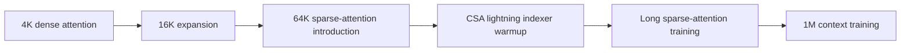

# DeepSeek V4 技术报告深度解读

## 0. 一句话结论

DeepSeek V4 的核心不是“又一个更大的模型”，而是把百万 token 上下文从“理论上能跑”推进到“系统上可部署”的一次工程化尝试。它同时动了四条关键线：

- 用 CSA、HCA、SWA 的混合注意力降低 1M 上下文的 FLOPs 与 KV cache。
- 用 mHC 和 Muon 支撑更深、更大、更稀疏的 MoE 训练。
- 用 specialist training、GRPO、GRM、OPD、QAT 把推理、代码、Agent、工具和指令遵循能力合并到统一模型。
- 用 MegaMoE、TileLang、异构 KV cache、on-disk prefix cache、百万上下文 RL 框架和 DSec 沙箱把模型结构落到训练和推理系统里。

报告中最重要的数字：

| 项目           | DeepSeek-V4-Flash | DeepSeek-V4-Pro |
| ------------ | ----------------: | --------------: |
| 总参数          |              284B |            1.6T |
| 每 token 激活参数 |               13B |             49B |
| 预训练 token    |               32T |             33T |
| 上下文长度        |                1M |              1M |
| CSA 压缩率 `m`  |                 4 |               4 |
| CSA top-k    |               512 |            1024 |
| HCA 压缩率 `m'` |               128 |             128 |
| SWA window   |               128 |             128 |

## 1. 架构总览

DeepSeek V4 仍然是 Transformer + MoE 的大框架，但核心路径发生了明显变化：

1. 继承 DeepSeekMoE：每层使用 MoE，包含 shared expert 和 routed experts。
2. 继承 MTP：multi-token prediction depth 为 1。
3. 新增 mHC：Manifold-Constrained Hyper-Connections，用受约束的残差映射增强深层信号传播。
4. 新增混合注意力：CSA + HCA + SWA 共同处理长上下文。
5. 新增 Muon 优化器：大多数模块用 Muon，少数模块保留 AdamW。
6. 新增训练稳定性技巧：Anticipatory Routing 和 SwiGLU Clamping。

### 1.1 V4-Flash

V4-Flash 是更强调性价比和小激活量的版本。

| 维度                       | 设置                            |
| ------------------------ | ----------------------------- |
| Transformer layers       | 43                            |
| hidden dimension         | 4096                          |
| total params             | 284B                          |
| activated params         | 13B                           |
| 前两层注意力                   | pure sliding window attention |
| 后续注意力                    | CSA/HCA interleaved           |
| CSA `m`                  | 4                             |
| CSA indexer heads        | 64                            |
| CSA indexer head dim     | 128                           |
| CSA top-k                | 512                           |
| HCA `m'`                 | 128                           |
| query heads              | 64                            |
| head dim                 | 512                           |
| query compression dim    | 1024                          |
| output projection groups | 8                             |
| MoE experts              | 1 shared + 256 routed         |
| activated routed experts | 6                             |
| expert hidden dim        | 2048                          |
| mHC expansion factor     | 4                             |
| Sinkhorn iterations      | 20                            |

### 1.2 V4-Pro

V4-Pro 是更大容量版本，主要目标是增强知识、复杂推理、长上下文和 Agent 能力。

| 维度                       | 设置                    |
| ------------------------ | --------------------- |
| Transformer layers       | 61                    |
| hidden dimension         | 7168                  |
| total params             | 1.6T                  |
| activated params         | 49B                   |
| 前两层注意力                   | HCA                   |
| 后续注意力                    | CSA/HCA interleaved   |
| CSA `m`                  | 4                     |
| CSA indexer heads        | 64                    |
| CSA indexer head dim     | 128                   |
| CSA top-k                | 1024                  |
| HCA `m'`                 | 128                   |
| query heads              | 128                   |
| head dim                 | 512                   |
| query compression dim    | 1536                  |
| output projection groups | 16                    |
| MoE experts              | 1 shared + 384 routed |
| activated routed experts | 6                     |
| expert hidden dim        | 3072                  |
| mHC expansion factor     | 4                     |
| Sinkhorn iterations      | 20                    |

## 2. 核心算法与公式

### 2.1 mHC：受流形约束的残差连接

普通 residual stream 是一条隐状态流。Hyper-Connections 会把 residual stream 扩展为 `n_hc` 条并行 residual states，然后用输入映射、残差映射、输出映射来组合。

基本更新：

```text
X_{l+1} = B_l X_l + C_l F_l(A_l X_l)
```

其中：

- `X_l` 是第 `l` 层前的 residual states。
- `F_l` 是第 `l` 个 Transformer/MoE 层。
- `A_l` 把 expanded residual stream 映射成层输入。
- `B_l` 负责 residual states 之间的变换。
- `C_l` 把层输出写回 expanded residual stream。

mHC 的关键是约束 `B_l` 属于 doubly stochastic matrices 的流形：

```text
B_l in M = { M in R^(n x n) | M 1_n = 1_n, 1_n^T M = 1_n^T, M >= 0 }
```

这样有两个好处：

- `||B_l||_2 <= 1`，残差变换是 non-expansive，不容易在深层堆叠中放大信号。
- doubly stochastic matrices 在乘法下封闭，有利于深层传播稳定。

实际参数化：

```text
M^(0) = exp(B_tilde_l)
M^(t) = T_row(T_col(M^(t-1)))
B_l = M^(t_max),  t_max = 20
```

这就是 Sinkhorn-Knopp 投影：先指数化保证正数，再交替做列归一化和行归一化，得到满足约束的矩阵。

### 2.2 CSA：Compressed Sparse Attention

CSA 的目标是：先把历史 KV cache 压缩，再从压缩后的历史块里选 top-k，而不是让每个 query 读所有历史 token。

压缩 KV：

```text
C_a = H W_aKV
C_b = H W_bKV
Z_a = H W_aZ
Z_b = H W_bZ
C_i^comp = sum_j S_a,j * C_a,j + sum_j S_b,j * C_b,j
```

解释：

- `H` 是输入 hidden states。
- `C_a` / `C_b` 是两路 KV entries。
- `Z_a` / `Z_b` 是压缩权重。
- 每 `m` 个 token 被压成一个 compressed entry。
- CSA 使用 overlapping compression，因此每个 compressed entry 实际来自相邻的 `2m` 个候选 token。

Lightning indexer：

```text
c_t^Q = h_t W_DQ
q_t^I = c_t^Q W_IUQ
I_{t,s} = sum_h w_{t,h}^I ReLU(q_{t,h}^I K_s^IComp)
C_t^sparse = { C_s^comp | I_{t,s} in Top-k(I_{t,:}) }
```

解释：

- query token `t` 先生成 indexer query。
- 对每个历史 compressed block `s` 打分。
- 只保留 top-k 压缩 KV entries 进入 core attention。
- V4-Flash top-k=512，V4-Pro top-k=1024。

CSA 的本质是把长上下文问题拆成两步：

1. 用压缩把序列长度缩短到约 `1/m`。
2. 用 top-k 稀疏选择进一步减少每个 query 真正读取的历史块。

### 2.3 HCA：Heavily Compressed Attention

HCA 的目标不同：它不做 sparse selection，而是把 KV 压得更狠，然后做稠密读取。

```text
C = H W_KV
Z = H W_Z
S = softmax_row(Z + B)
C_i^comp = sum_j S_j * C_j
```

差别：

- CSA 的压缩率是 `m=4`。
- HCA 的压缩率是 `m'=128`。
- CSA 是“压缩 + 稀疏检索”。
- HCA 是“重压缩 + 稠密全局记忆”。

这就是为什么报告把 CSA 和 HCA 交错使用：CSA 更像可检索的中远程记忆，HCA 更像极长上下文下的全局摘要记忆。

### 2.4 SWA：Sliding Window Attention

CSA/HCA 都只能读已经完成压缩的历史块。为了严格保持 causality，query 无法读自己所在压缩块里的未来 token，也容易丢掉近邻细节。

因此 V4 在 CSA/HCA 外加了一条 sliding window branch：

- 每个 query 额外读取最近 `n_win=128` 个未压缩 KV entries。
- 这条分支负责局部语言建模、短程依赖和细粒度信息。

### 2.5 Attention Sink

报告采用 attention sink：

```text
s_{h,i,j} = exp(z_{h,i,j}) / (sum_k exp(z_{h,i,k}) + exp(z'_h))
```

普通 attention 中，每个 head 的注意力质量必须分配完，总和为 1。加入 sink logit 后，一部分注意力质量可以被 sink 吸收，从而允许某个 head 不强行关注任何 token 或 block。

这对压缩注意力有意义：当检索到的压缩块并不可靠或当前 head 不需要长程信息时，它不必把概率硬塞给无关 block。

### 2.6 Muon 优化器

V4 用 Muon 更新大多数模块，用 AdamW 更新少量模块：

- embedding module
- prediction head
- RMSNorm weights
- mHC static biases 和 gating factors

Muon 伪公式：

```text
G_t = grad_W L_t(W_{t-1})
M_t = mu M_{t-1} + G_t
O'_t = HybridNewtonSchulz(mu M_t + G_t)
O_t = O'_t * sqrt(max(n,m)) * gamma
W_t = W_{t-1} * (1 - eta lambda) - eta O_t
```

关键点：

- momentum `mu=0.95`
- weight decay `0.1`
- update RMS rescale factor `0.18`
- 使用 Nesterov trick
- 使用 hybrid Newton-Schulz 近似正交化

Hybrid Newton-Schulz：

```text
M_k = a M_{k-1}
    + b (M_{k-1} M_{k-1}^T) M_{k-1}
    + c (M_{k-1} M_{k-1}^T)^2 M_{k-1}
```

前 8 步用 `(a,b,c)=(3.4445,-4.7750,2.0315)` 快速推动奇异值接近 1，后 2 步用 `(2,-1.5,0.5)` 稳定收敛。

### 2.7 OPD：On-Policy Distillation

后训练阶段，V4 用多教师 OPD 合并专家能力：

```text
L_OPD(theta) = sum_i w_i * KL(pi_theta || pi_Ei)
```

含义：

- `pi_theta` 是学生模型。
- `pi_Ei` 是第 `i` 个专家教师模型。
- 训练轨迹由学生模型自己采样，所以是 on-policy。
- 使用 reverse KL，让学生在当前任务上向相关专家对齐。
- 报告使用 full-vocabulary logit distillation，而不是 token-level KL 近似，以降低梯度估计方差。

## 3. 数据构造

报告披露了数据方向，但没有披露精确配比。因此不能安全地画“数据占比图”。

已披露的数据构造点：

- 以 DeepSeek-V3 的预训练数据为基础。
- 提升多样性、质量和有效长上下文。
- Web 数据过滤批量自动生成和模板化内容，降低 model collapse 风险。
- 数学和编程语料仍是核心。
- mid-training 阶段加入 agentic data，增强 coding 和 agentic 能力。
- 构建更大的 multilingual corpus，以覆盖长尾文化知识。
- 强调 long-document curation，优先 scientific papers、technical reports 等学术价值材料。
- 总预训练语料超过 32T tokens。
- tokenizer 维持 128K 词表。
- 继承 token-splitting 和 Fill-in-Middle。
- 新增少量 context construction special tokens。
- 使用跨来源 document packing，减少样本截断。
- 使用 sample-level attention masking。

数据部分的最大缺口：

- 未公开网页、数学、代码、多语言、长文档、agentic data 的 token 占比。
- 未公开去重阈值、污染检测细节、合成数据比例。
- 未公开不同阶段的数据 curriculum 细节。

因此，最稳妥的读法是：数据策略非常重要，但不能从报告中推断具体 mixture recipe。

## 4. 预训练流程

### 4.1 V4-Flash 训练设置

| 项目                                    |                          设置 |
| ------------------------------------- | --------------------------: |
| tokens                                |                         32T |
| max batch size                        |                75.5M tokens |
| AdamW beta1                           |                         0.9 |
| AdamW beta2                           |                        0.95 |
| AdamW epsilon                         |                       1e-20 |
| weight decay                          |                         0.1 |
| Muon momentum                         |                        0.95 |
| Muon update RMS rescale               |                        0.18 |
| peak LR                               |                      2.7e-4 |
| final LR                              |                      2.7e-5 |
| LR warmup                             |                  2000 steps |
| sequence length schedule              |      4K -> 16K -> 64K -> 1M |
| dense attention warmup                |             first 1T tokens |
| auxiliary-loss-free bias update speed |                       0.001 |
| balance loss weight                   |                      0.0001 |
| MTP loss weight                       | 0.3, then 0.1 near LR decay |

### 4.2 V4-Pro 训练设置

| 项目                        |                                   设置 |
| ------------------------- | -----------------------------------: |
| tokens                    |                                  33T |
| max batch size            |                         94.4M tokens |
| peak LR                   |                               2.0e-4 |
| final LR                  |                               2.0e-5 |
| sequence length schedule  |               4K -> 16K -> 64K -> 1M |
| dense attention stage     |                    longer than Flash |
| sparse attention strategy | same two-stage introduction as Flash |
| balance loss weight       |                               0.0001 |
| MTP loss weight           |          0.3, then 0.1 near LR decay |

### 4.3 稀疏注意力引入流程



这里的要点是：模型不是一开始就用 1M sparse attention 硬训，而是从较短序列、dense attention 和 indexer warmup 逐步过渡。

## 5. 训练稳定性

训练万亿参数 MoE 时，报告遇到了 loss spikes。作者认为 spike 与 MoE outliers 和 routing 机制形成的恶性循环相关。

### 5.1 Anticipatory Routing

核心想法：

- step `t` 的 feature computation 用当前参数 `theta_t`。
- routing indices 用历史参数 `theta_{t-Delta t}` 计算。
- 这样把 backbone update 和 routing update 解耦。

工程实现：

- 在 `t-Delta t` 时提前获取 step `t` 的数据。
- 提前计算并缓存 routing indices。
- loss spike 发生时触发短 rollback 并启用 Anticipatory Routing。
- 运行一段时间后回到标准训练。

报告声称额外 wall-clock overhead 被优化到约 20%，并且由于只在 spike 时动态启用，总体额外开销可忽略。

### 5.2 SwiGLU Clamping

V4 对 SwiGLU 做 clamp：

- linear component 限制在 `[-10, 10]`
- gate component 上界限制为 `10`

这个方法直接压制异常值。报告承认其理论机制尚不充分，但经验上能稳定训练且不损害性能。

## 6. 后训练流程

后训练的关键变化：用 OPD 替代 DeepSeek-V3.2 的 mixed RL 阶段。


### 6.1 Specialist training

每个专家模型先经过：

1. initial fine-tuning
2. domain-specific GRPO RL

领域包括：

- math
- coding
- agentic tasks
- instruction following
- tool use
- long-context tasks

### 6.2 Reasoning Effort 三档

| Mode       | 特征        | 典型场景          | Response format                       |
| ---------- | --------- | ------------- | ------------------------------------- |
| Non-think  | 快速、直觉、低延迟 | 日常任务、低风险决策    | `</think> summary`                    |
| Think High | 更慢、更逻辑化   | 复杂问题、规划、中风险决策 | `<think>...</think> summary`          |
| Think Max  | 推理预算最大    | 探索模型推理边界      | 特殊系统提示 + `<think>...</think> summary` |

Think Max 会注入特殊系统提示，要求模型完整分解问题、压力测试逻辑、考虑边界和对抗路径。

### 6.3 Generative Reward Model

传统 RLHF 往往训练 scalar reward model。V4 报告中更强调 Generative Reward Model：

- 对 hard-to-verify tasks，使用 rubric-guided RL data。
- actor network 同时承担生成与评价能力。
- 通过模型自身推理能力产生更鲁棒的评分。
- 减少对大规模人工标注的依赖。

### 6.4 Tool-call schema

V4 引入 DSML/XML 风格工具调用：

```xml
<|DSML|tool_calls>
<|DSML|invoke name="$TOOL_NAME">
<|DSML|parameter name="$PARAMETER_NAME" string="true|false">
$PARAMETER_VALUE
</|DSML|parameter>
</|DSML|invoke>
</|DSML|tool_calls>
```

设计目标：

- 降低 JSON/字符串 escaping failure。
- 减少 tool-call error。
- 对 thinking mode 和 tool calls 的顺序做明确约束。

### 6.5 Interleaved thinking

V4 在 tool-calling 场景保留 reasoning traces：

- 工具调用场景：跨所有轮次保留 reasoning 内容，包括跨用户消息边界。
- 普通聊天场景：新用户消息到来时丢弃前一轮 reasoning，以保持上下文简洁。

这和 1M context 直接相关：长周期 Agent 可以把推理状态保留下来，不必每轮重新构建。

### 6.6 Quick Instruction

Quick Instruction 把辅助任务变成特殊 token，而不是额外调用小模型：

| Token | 作用             |       |                        |     |               |
| ----- | -------------- | ----- | ---------------------- | --- | ------------- |
| `<   | action         | >`   | 判断是否需要 web search      |     |               |
| `<   | title          | >`   | 生成对话标题                 |     |               |
| `<   | query          | >`   | 生成搜索 query             |     |               |
| `<   | authority      | >`   | 判断 source authority 需求 |     |               |
| `<   | domain         | >`   | 判断用户问题领域               |     |               |
| `<   | extracted_url | >`/`< | read_url              | >` | 判断 URL 是否需要读取 |

优势：

- 复用已计算 KV cache。
- 避免额外小模型重复 prefill。
- 降低用户感知 TTFT。
- 可让 query、authority、domain 等任务并行执行。

## 7. 后训练基础设施

### 7.1 FP4 Quantization-Aware Training

QAT 应用于两个组件：

1. MoE expert weights
2. CSA indexer 的 QK path

报告称：

- CSA index scores 从 FP32 量化到 BF16。
- top-k selector 获得 2x speedup。
- KV entry recall rate 保持 99.7%。
- FP4 expert weights 在训练中先量化再反量化到 FP8 计算。
- rollout/inference 阶段直接使用 native FP4 weights，确保采样行为与线上部署一致。

### 7.2 Full-vocabulary OPD teacher scheduling

难点：

- 教师模型超过 10 个。
- 每个教师可能是万亿参数。
- vocab size 超过 100K，直接缓存所有 teacher logits 不现实。

解决：

- 教师权重放在集中式分布式存储。
- teacher forward 时按需加载。
- 不缓存完整 logits，只缓存 last-layer hidden states。
- 训练时再经过对应 prediction head 重建 full logits。
- 按 teacher index 排列样本，使每个 mini-batch 同一时间只加载一个 teacher head。
- KL divergence 用专门 TileLang kernel 计算。

### 7.3 Fault-tolerant rollout service

RL/OPD rollout 在大 GPU 集群上会遇到抢占和硬件故障。报告使用 token-granular WAL：

- 每生成一个 token，立即写入对应 request 的 WAL。
- 抢占时暂停 inference engine 并保存未完成请求的 KV cache。
- 恢复时用 WAL 和保存的 KV cache 继续 decode。
- fatal hardware error 时，可用 WAL tokens 重新 prefill 来重建 KV cache。

报告特别指出：中断后从头重新生成未完成请求在数学上不正确，因为会引入 length bias，短回答更容易幸存，长回答更容易被重采样影响。

## 8. 通用基础设施

### 8.1 MegaMoE

MegaMoE 把专家并行路径拆成细粒度流水：

- Dispatch
- Linear-1
- SwiGLU / FP8 cast
- Linear-2
- Combine

通过 wave-level pipeline，把通信、计算、结果回传重叠。

报告声称：

- 常规推理场景：1.50x 到 1.73x 加速。
- 延迟敏感场景：最高 1.96x。

### 8.2 TileLang

TileLang 是用于 kernel 开发的 DSL。报告中它主要解决：

- 大量细小 ATen operators 的 overhead。
- fused kernel 编写效率。
- 注意力变体实验速度。
- OPD KL 计算等特殊 kernel。

### 8.3 Deterministic kernels

DeepSeek 强调 batch-invariant 和 deterministic kernel：

- MoE dispatch deterministic
- MoE combine deterministic
- mHC small matrix multiplication deterministic

意义：减少 batch 变化导致的非确定输出，这对于训练复现、服务稳定和评测一致性都很重要。

### 8.4 KV cache 管理

V4 的 KV cache 不再是同构结构，而是包含多种缓存：

- CSA/HCA compressed KV
- CSA indexer KV
- SWA uncompressed KV
- 未完成压缩尾部状态

传统 PagedAttention 假设 KV shape 同构，V4 需要异构布局和管理策略。

### 8.5 On-disk prefix cache

长上下文服务中，许多请求共享长 prefix。V4 把 compressed KV 存盘复用。

SWA KV 约为 compressed KV 的 8 倍，因此提供三种策略：

- full caching：存全部 SWA KV，恢复最快，占空间最大。
- periodic checkpointing：按周期存 checkpoint，空间和恢复时间折中。
- zero caching：不存 SWA KV，需要重算，空间最省。

## 9. 评测结果

### 9.1 Base 模型 Table 1

Table 1 是预训练后的 base 模型评测，统一内部框架下比较 V3.2 Base、V4-Flash Base、V4-Pro Base。

| Benchmark          | V3.2 Base | V4-Flash Base | V4-Pro Base |
| ------------------ | --------: | ------------: | ----------: |
| Activated Params   |       37B |           13B |         49B |
| Total Params       |      671B |          284B |        1.6T |
| MMLU               |      87.8 |          88.7 |        90.1 |
| MMLU-Pro           |      65.5 |          68.3 |        73.5 |
| MultiLoKo          |      38.7 |          42.2 |        51.1 |
| Simple-QA verified |      28.3 |          30.1 |        55.2 |
| FACTS Parametric   |      27.1 |          33.9 |        62.6 |
| HumanEval          |      62.8 |          69.5 |        76.8 |
| GSM8K              |      91.1 |          90.8 |        92.6 |
| MATH               |      60.5 |          57.4 |        64.5 |
| LongBench-V2       |      40.2 |          44.7 |        51.5 |

读法：

- V4-Flash 激活参数显著少于 V3.2，但在多个 benchmark 上更强，说明架构/数据/训练优化有效。
- V4-Pro 在知识类任务上提升尤其明显，如 Simple-QA verified、FACTS Parametric。
- BigCodeBench 上 V4 不一定全面超过 V3.2，说明 base coding 表现并非所有项单调提升。

### 9.2 Post-trained 模型 Table 7

Table 7 比较 V4-Flash 和 V4-Pro 的 Non-think、High、Max 三种模式。

| Benchmark          | Flash Non | Flash High | Flash Max | Pro Non | Pro High | Pro Max |
| ------------------ | --------: | ---------: | --------: | ------: | -------: | ------: |
| MMLU-Pro           |      83.0 |       86.4 |      86.2 |    82.9 |     87.1 |    87.5 |
| SimpleQA-Verified  |      23.1 |       28.9 |      34.1 |    45.0 |     46.2 |    57.9 |
| Chinese-SimpleQA   |      71.5 |       73.2 |      78.9 |    75.8 |     77.7 |    84.4 |
| GPQA Diamond       |      71.2 |       87.4 |      88.1 |    72.9 |     89.1 |    90.1 |
| HLE                |       8.1 |       29.4 |      34.8 |     7.7 |     34.5 |    37.7 |
| LiveCodeBench      |      55.2 |       88.4 |      91.6 |    56.8 |     89.8 |    93.5 |
| Codeforces Rating  |         - |       2816 |      3052 |       - |     2919 |    3206 |
| HMMT 2026 Feb      |      40.8 |       91.9 |      94.8 |    31.7 |     94.0 |    95.2 |
| IMOAnswerBench     |      41.9 |       85.1 |      88.4 |    35.3 |     88.0 |    89.8 |
| Apex               |       1.0 |       19.1 |      33.0 |     0.4 |     27.4 |    38.3 |
| Apex Shortlist     |       9.3 |       72.1 |      85.7 |     9.2 |     85.5 |    90.2 |
| MRCR 1M            |      37.5 |       76.9 |      78.7 |    44.7 |     83.3 |    83.5 |
| CorpusQA 1M        |      15.5 |       59.3 |      60.5 |    35.6 |     56.5 |    62.0 |
| Terminal Bench 2.0 |      49.1 |       56.6 |      56.9 |    59.1 |     63.3 |    67.9 |
| SWE Verified       |      73.7 |       78.6 |      79.0 |    73.6 |     79.4 |    80.6 |
| SWE Pro            |      49.1 |       52.3 |      52.6 |    52.1 |     54.4 |    55.4 |
| SWE Multilingual   |      69.7 |       70.2 |      73.3 |    69.8 |     74.1 |    76.2 |
| BrowseComp         |         - |       53.5 |      73.2 |       - |     80.4 |    83.4 |
| HLE w/ tools       |         - |       40.3 |      45.1 |       - |     44.7 |    48.2 |
| MCPAtlas Public    |      64.0 |       67.4 |      69.0 |    69.4 |     74.2 |    73.6 |
| GDPval-AA          |         - |          - |      1395 |       - |        - |    1554 |
| Toolathlon         |      40.7 |       43.5 |      47.8 |    46.3 |     49.0 |    51.8 |

主要结论：

- 难推理任务对 reasoning effort 极其敏感，尤其是 GPQA、HLE、LiveCodeBench、HMMT、Apex。
- 长上下文任务也明显受 High/Max 影响，但 1M context 并不等于“完美记忆”。
- Agentic 任务中 Pro 通常强于 Flash，但外部闭源模型仍在一些任务上领先。

### 9.3 Table 6 外部模型对比

部分代表性数字：

| Benchmark          | Opus-4.6 Max | GPT-5.4 xHigh | Gemini-3.1 High | K2.6 Thinking | GLM-5.1 Thinking | DS-V4-Pro Max |
| ------------------ | -----------: | ------------: | --------------: | ------------: | ---------------: | ------------: |
| MMLU-Pro           |         89.1 |          87.5 |            91.0 |          87.1 |             86.0 |          87.5 |
| SimpleQA-Verified  |         46.2 |          45.3 |            75.6 |          36.9 |             38.1 |          57.9 |
| GPQA Diamond       |         91.3 |          93.0 |            94.3 |          90.5 |             86.2 |          90.1 |
| HLE                |         40.0 |          39.8 |            44.4 |          36.4 |             34.7 |          37.7 |
| LiveCodeBench      |         88.8 |             - |            91.7 |          89.6 |                - |          93.5 |
| Codeforces Rating  |            - |          3168 |            3052 |             - |                - |          3206 |
| MRCR 1M            |         92.9 |             - |            76.3 |             - |                - |          83.5 |
| Terminal Bench 2.0 |         65.4 |          75.1 |            68.5 |          66.7 |             63.5 |          67.9 |
| BrowseComp         |         83.7 |          82.7 |            85.9 |          83.2 |             79.3 |          83.4 |
| Toolathlon         |         47.2 |          54.6 |            48.8 |          50.0 |             40.7 |          51.8 |

读法：

- DS-V4-Pro-Max 在开源模型中很强，尤其是代码和部分数学/工具任务。
- 与最强闭源模型相比，它不是全面领先。
- Gemini 在 SimpleQA、Chinese-SimpleQA、GPQA、HLE 等知识/推理项很强。
- GPT-5.4 xHigh 在 Terminal Bench、GDPval-AA、Toolathlon 等 Agent/工具项很强。
- Opus 在 MRCR 1M、CorpusQA 1M、SWE 等场景仍有优势。

### 9.4 Search 评测

Agentic Search vs RAG：

| Difficulty | Category        |   N | Agent win | RAG win | Tie | Agent% | RAG% | Tie% |
| ---------- | --------------- | --: | --------: | ------: | --: | -----: | ---: | ---: |
| Easy       | Objective Q\&A  | 196 |       110 |      43 |  43 |   56.1 | 21.9 | 21.9 |
| Easy       | Subjective Q\&A | 321 |       198 |      56 |  67 |   61.7 | 17.4 | 20.9 |
| Hard       | Objective Q\&A  | 168 |       102 |      33 |  33 |   60.7 | 19.6 | 19.6 |
| Hard       | Subjective Q\&A | 184 |       126 |      27 |  31 |   68.5 | 14.7 | 16.8 |
| Total      | Total           | 869 |       536 |     159 | 174 |   61.7 | 18.3 | 20.0 |

成本：

| Version           | Tool calls | Prefill tokens | Output tokens |
| ----------------- | ---------: | -------------: | ------------: |
| V4 Agentic Search |       16.2 |         13,649 |         1,526 |
| V4 RAG            |          - |         10,453 |         1,308 |

读法：

- Agentic Search 更强，但也更贵。
- 多数 tool calls 可并行，因此工具次数不直接等于延迟。
- 主观问答和困难主观问答中 Agentic Search 优势最大。

### 9.5 中文写作与办公任务

功能写作 Table 12：

| 总体                         | DS win | Gemini win |   Tie |
| -------------------------- | -----: | ---------: | ----: |
| Chinese Functional Writing | 62.65% |     34.10% | 3.25% |

创作写作 Table 13：

| 维度                    | DS win | Gemini win |   Tie |
| --------------------- | -----: | ---------: | ----: |
| Instruction Following | 60.03% |     39.44% | 0.53% |
| Writing Quality       | 77.48% |     22.35% | 0.18% |

复杂指令与多轮写作 Table 14：

| Category                      |   DS% | Opus% | Tie% |
| ----------------------------- | ----: | ----: | ---: |
| Complex Instruction Following | 46.9% | 53.1% | 0.0% |
| Multi-Turn Writing            | 45.6% | 51.7% | 2.7% |

白领任务：

- 30 个高级中文专业任务。
- 覆盖 13 个行业，如 finance、education、law、technology。
- 使用内部 Agent harness，带 Bash 和 web search。
- 与 Opus-4.6-Max 进行盲评。

维度分数：

| Dimension             | DeepSeek-V4-Pro-Max | Opus-4.6-Max |
| --------------------- | ------------------: | -----------: |
| Task Completion       |               98.32 |        96.68 |
| Instruction Following |               87.76 |        88.88 |
| Content Quality       |               83.32 |        78.00 |
| Formatting Aesthetics |               72.68 |        76.68 |
| Overall               |               86.52 |        84.06 |

读法：

- DS 在任务完成和内容质量上更强。
- Opus 在指令跟随和格式美观上略优。
- 报告也承认 DS 在压缩长输入摘要、幻灯片视觉设计上还有提升空间。

### 9.6 Code Agent

内部 R\&D Coding Benchmark：

| Model               | Pass Rate |
| ------------------- | --------: |
| Haiku 4.5           |       13% |
| Sonnet 4.5          |       47% |
| DeepSeek-V4-Pro-Max |       67% |
| Opus 4.5            |       70% |
| Opus 4.5 Thinking   |       73% |
| Opus 4.6 Thinking   |       80% |

数据集说明：

- 从约 200 个内部真实 R\&D 任务中收集。
- 涉及 50+ 内部工程师。
- 覆盖 feature development、bug fixing、refactoring、diagnostics。
- 技术栈包括 PyTorch、CUDA、Rust、C\++。
- 严格质量过滤后保留 30 个任务。

内部使用者调查：

- N=85，均为日常使用 DeepSeek-V4-Pro 做 agentic coding 的 DeepSeek 开发者和研究员。
- 52% 认为可以作为默认主力 coding model。
- 39% 倾向于 yes。
- 少于 9% 说 no。

## 10. 我会如何使用这份报告

### 10.1 值得重点关注

1. 长上下文低成本化路线：CSA/HCA/SWA 是这篇报告最重要的架构贡献。
2. 1M context 下的服务系统：异构 KV cache、on-disk prefix cache、百万上下文 RL 框架都值得细看。
3. 后训练合并：OPD 替代 mixed RL，说明能力合并正在从“权重合并/混合训练”转向更细的 logits-level distillation。
4. Agent 基础设施：DSec、tool schema、interleaved thinking、Quick Instruction 都是面向真实 Agent 产品的设计。

### 10.2 不能过度外推

1. 1M context 不等于完美记忆。MRCR 和 CorpusQA 仍显示明显难度。
2. FLOPs/KV cache 降低不等于真实 API 更便宜。价格还取决于硬件、batching、cache hit rate、并发、供应商定价。
3. 训练格式不等于 API 承诺。报告里的 `<think>`、DSML、tool schema 不应直接解读成最终开放接口。
4. 数据配比没有公开。不能从报告反推出训练 recipe。
5. 很多评测是内部口径。Table 1、搜索、白领任务、R\&D coding 都有内部框架或内部 harness 成分。
6. 稳定性技巧仍偏经验。Anticipatory Routing 和 SwiGLU Clamping 有效，但理论机制仍开放。

## 11. 最终判断

DeepSeek V4 的价值不只在榜单分数，而在它提出了一条非常明确的长上下文工程路线：

```text
压缩注意力 -> 稀疏检索 -> 重压缩全局记忆 -> 局部窗口补细节
        -> MoE 容量扩展 -> Muon 稳定训练 -> OPD 合并专家
        -> FP4/QAT/缓存/沙箱/rollout 系统支撑部署
```

如果后续 API 能稳定提供 1M 上下文、可控 reasoning effort、合理价格和可靠工具调用，这套技术路线会直接影响代码库级 Agent、长文档研究、企业知识库、浏览式搜索和复杂办公自动化。

但在独立复现和实际服务规格出来之前，最稳妥的态度是：把这份报告当作一份非常有信息量的系统设计说明，而不是把所有 benchmark 和成本结论直接当作市场最终答案。
